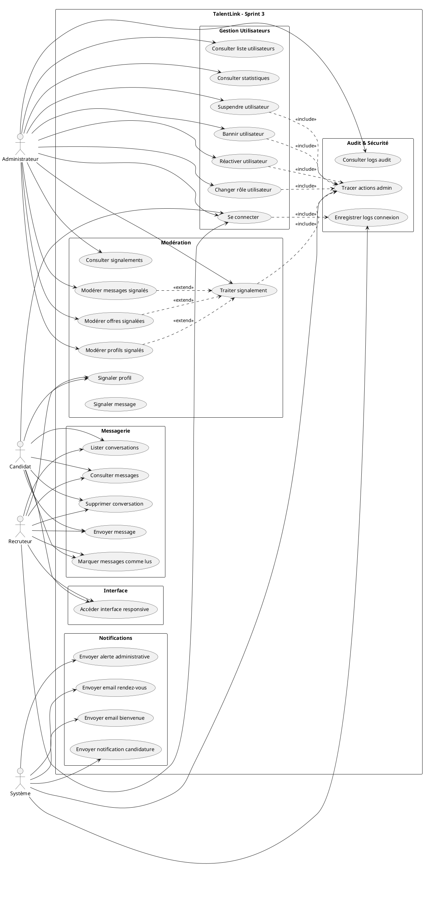
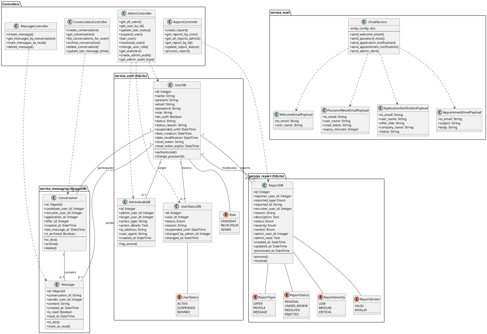
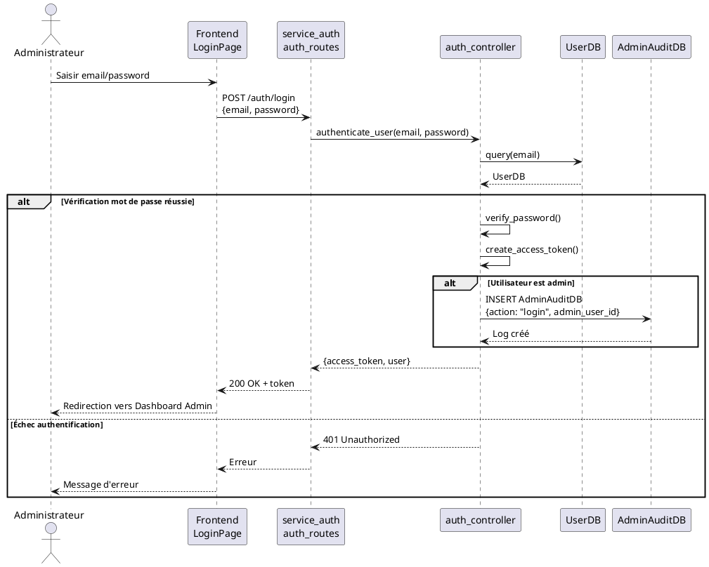
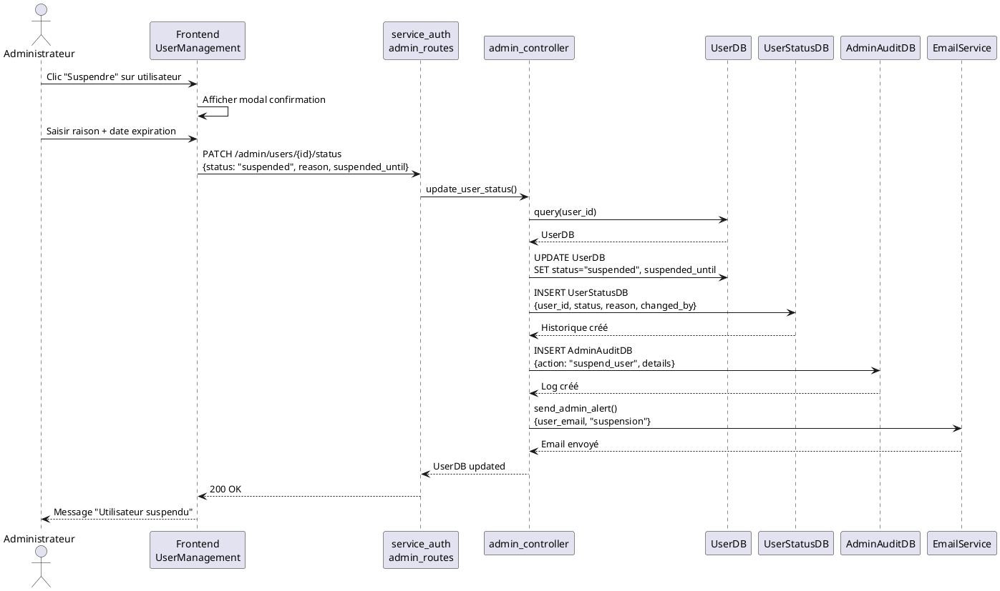
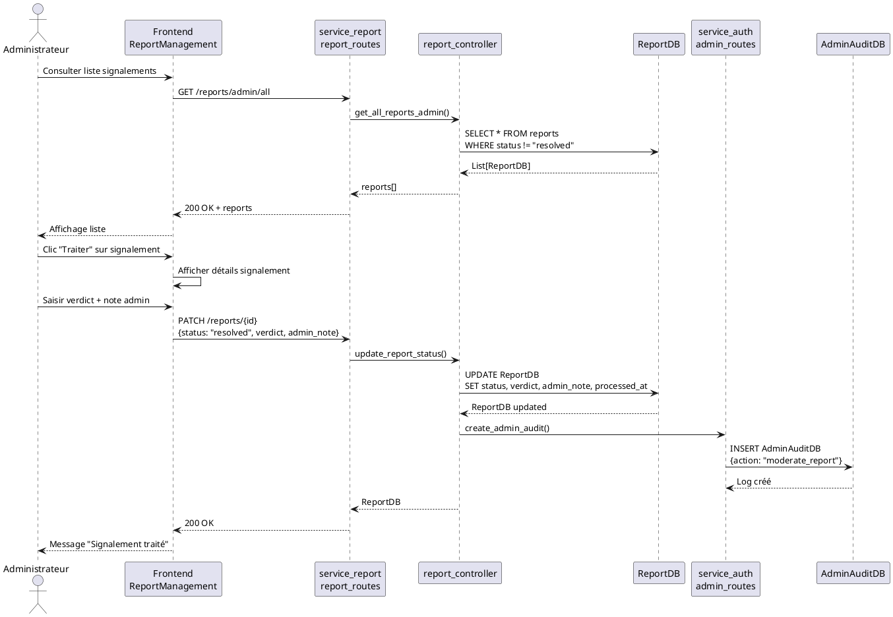
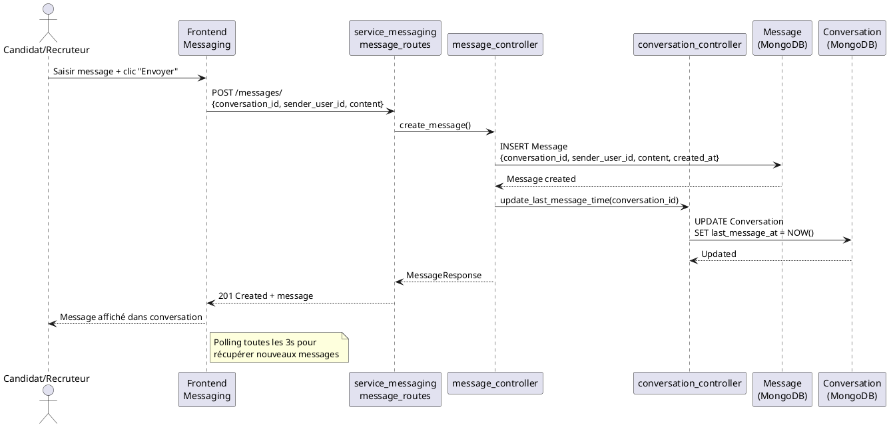
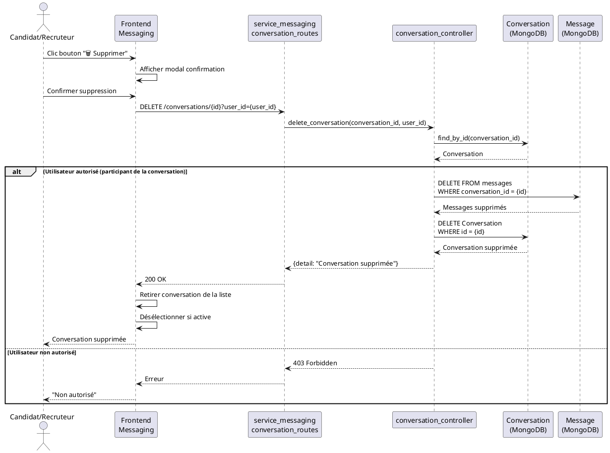
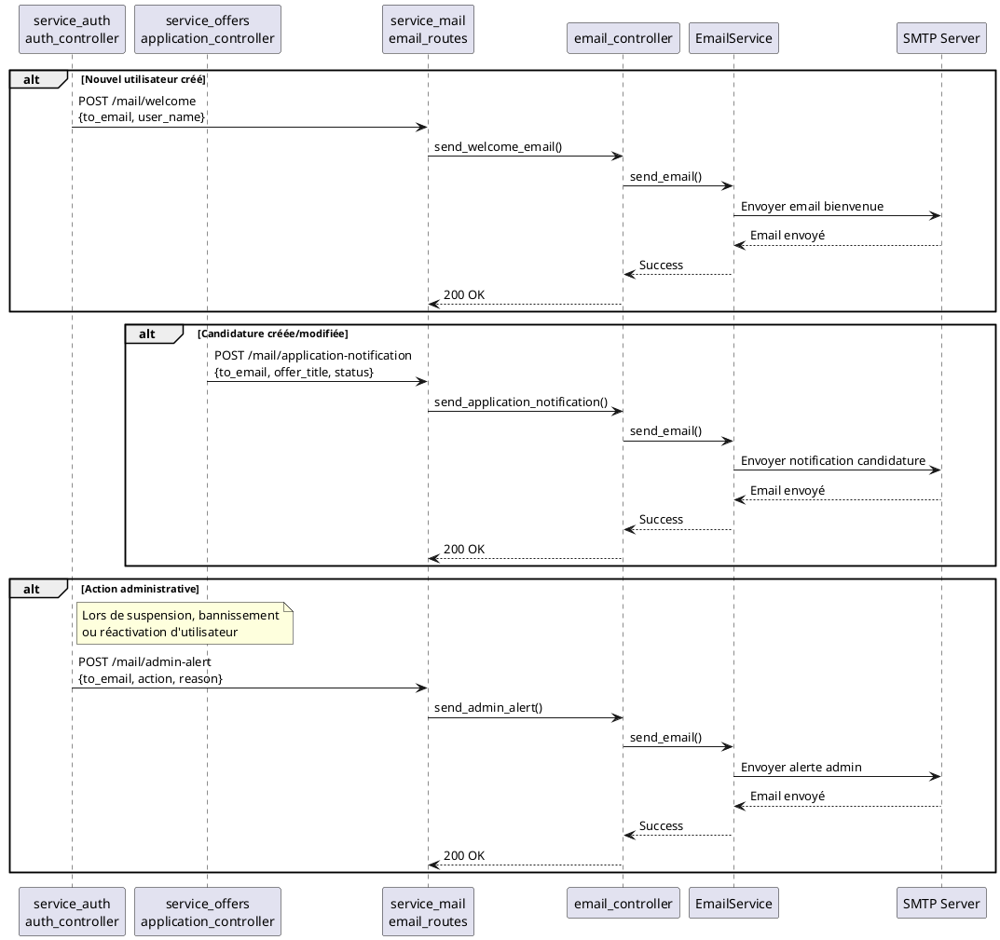
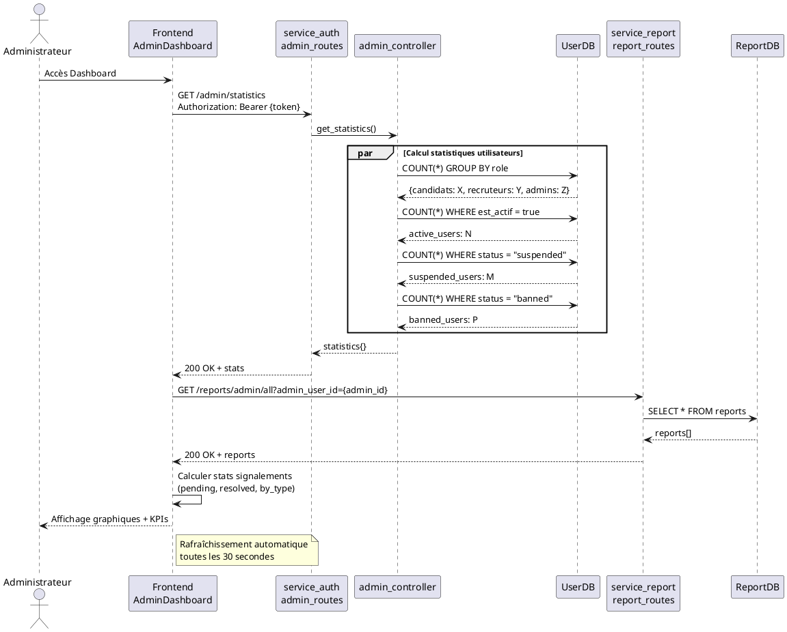

# Diagrammes UML - Sprint 3 TalentLink

## Table des matières
1. [Diagramme de Cas d'Utilisation](#1-diagramme-de-cas-dutilisation)
2. [Diagramme de Classes](#2-diagramme-de-classes)
3. [Diagrammes de Séquence](#3-diagrammes-de-séquence)

---

## 1. Diagramme de Cas d'Utilisation

---

## 2. Diagramme de Classes

---

## 3. Diagrammes de Séquence

### 3.1 Connexion Administrateur

### 3.2 Suspension d'un Utilisateur par Admin

### 3.3 Modération d'un Signalement

### 3.4 Envoi de Message dans Conversation

### 3.5 Suppression de Conversation

### 3.6 Envoi de Notifications Email

### 3.7 Consultation des Statistiques Admin

---

## Notes d'Implémentation

### Technologies Utilisées
- **Backend**: FastAPI (Python 3.9+)
- **Bases de données**: 
  - SQLite (service_auth, service_report)
  - MongoDB (service_messaging)
- **Frontend**: React 18 + React Router
- **Communication**: REST API
- **Email**: SMTP (service_mail)

### Services Microservices
1. **service_auth** (Port 8001): Authentification, gestion utilisateurs, admin
2. **service_messaging** (Port 8004): Conversations et messages
3. **service_report** (Port 8007): Signalements et modération
4. **service_mail** (Port 8005): Notifications email

### Sécurité
- Authentification JWT avec tokens Bearer
- Hachage des mots de passe (bcrypt)
- Audit trail des actions administratives
- Vérification des rôles pour routes admin
- Protection anti-brute force sur reset password

### Interface Responsive
- Design adaptatif (Desktop, Tablet, Mobile)
- CSS Grid et Flexbox
- Media queries pour breakpoints
- Composants React réutilisables

---

**Date de création**: 6 décembre 2025  
**Version**: Sprint 3 - v1.0  
**Projet**: TalentLink - Plateforme de recrutement
