# Diagrammes UML - Sprint 3 TalentLink

## Table des matières
1. [Diagramme de Cas d'Utilisation](#1-diagramme-de-cas-dutilisation)
2. [Diagramme de Classes](#2-diagramme-de-classes)
3. [Diagrammes de Séquence](#3-diagrammes-de-séquence)

---

## 1. Diagramme de Cas d'Utilisation

```plantuml
@startuml Sprint3_UseCase
left to right direction
skinparam packageStyle rectangle

actor "Administrateur" as Admin
actor "Candidat" as Candidat
actor "Recruteur" as Recruteur
actor "Système" as System

rectangle "TalentLink - Sprint 3" {
  
  package "Gestion Utilisateurs" {
    usecase "Se connecter" as UC1
    usecase "Consulter liste utilisateurs" as UC2
    usecase "Consulter statistiques" as UC3
    usecase "Suspendre utilisateur" as UC4
    usecase "Bannir utilisateur" as UC5
    usecase "Réactiver utilisateur" as UC6
    usecase "Changer rôle utilisateur" as UC7
  }
  
  package "Modération" {
    usecase "Consulter signalements" as UC8
    usecase "Modérer offres signalées" as UC9
    usecase "Modérer profils signalés" as UC10
    usecase "Modérer messages signalés" as UC11
    usecase "Traiter signalement" as UC12
    usecase "Signaler profil" as UC13
    usecase "Signaler message" as UC14
  }
  
  package "Messagerie" {
    usecase "Lister conversations" as UC15
    usecase "Consulter messages" as UC16
    usecase "Envoyer message" as UC17
    usecase "Supprimer conversation" as UC18
    usecase "Marquer messages comme lus" as UC19
  }
  
  package "Notifications" {
    usecase "Envoyer email bienvenue" as UC20
    usecase "Envoyer notification candidature" as UC21
    usecase "Envoyer alerte administrative" as UC22
    usecase "Envoyer email rendez-vous" as UC23
  }
  
  package "Audit & Sécurité" {
    usecase "Enregistrer logs connexion" as UC24
    usecase "Tracer actions admin" as UC25
    usecase "Consulter logs audit" as UC26
  }
  
  package "Interface" {
    usecase "Accéder interface responsive" as UC27
  }
}

' Relations Administrateur
Admin --> UC1
Admin --> UC2
Admin --> UC3
Admin --> UC4
Admin --> UC5
Admin --> UC6
Admin --> UC7
Admin --> UC8
Admin --> UC9
Admin --> UC10
Admin --> UC11
Admin --> UC12
Admin --> UC26

' Relations Candidat
Candidat --> UC1
Candidat --> UC15
Candidat --> UC16
Candidat --> UC17
Candidat --> UC18
Candidat --> UC19
Candidat --> UC13
Candidat --> UC27

' Relations Recruteur
Recruteur --> UC1
Recruteur --> UC15
Recruteur --> UC16
Recruteur --> UC17
Recruteur --> UC18
Recruteur --> UC19
Recruteur --> UC13
Recruteur --> UC27

' Relations Système
System --> UC20
System --> UC21
System --> UC22
System --> UC23
System --> UC24
System --> UC25

' Extensions et inclusions
UC4 ..> UC25 : <<include>>
UC5 ..> UC25 : <<include>>
UC6 ..> UC25 : <<include>>
UC7 ..> UC25 : <<include>>
UC12 ..> UC25 : <<include>>
UC1 ..> UC24 : <<include>>

UC9 ..> UC12 : <<extend>>
UC10 ..> UC12 : <<extend>>
UC11 ..> UC12 : <<extend>>

@enduml
```

---

## 2. Diagramme de Classes

---

## 3. Diagrammes de Séquence

### 3.1 Connexion Administrateur

```plantuml
@startuml Sprint3_Seq_AdminLogin
actor Administrateur
participant "Frontend\nLoginPage" as Frontend
participant "service_auth\nauth_routes" as AuthRoutes
participant "auth_controller" as AuthController
participant "UserDB" as DB
participant "AdminAuditDB" as AuditDB

Administrateur -> Frontend: Saisir email/password
Frontend -> AuthRoutes: POST /auth/login\n{email, password}
AuthRoutes -> AuthController: authenticate_user(email, password)
AuthController -> DB: query(email)
DB --> AuthController: UserDB

alt Vérification mot de passe réussie
  AuthController -> AuthController: verify_password()
  AuthController -> AuthController: create_access_token()
  
  alt Utilisateur est admin
    AuthController -> AuditDB: INSERT AdminAuditDB\n{action: "login", admin_user_id}
    AuditDB --> AuthController: Log créé
  end
  
  AuthController --> AuthRoutes: {access_token, user}
  AuthRoutes --> Frontend: 200 OK + token
  Frontend --> Administrateur: Redirection vers Dashboard Admin
  
else Échec authentification
  AuthController --> AuthRoutes: 401 Unauthorized
  AuthRoutes --> Frontend: Erreur
  Frontend --> Administrateur: Message d'erreur
end

@enduml
```

### 3.2 Suspension d'un Utilisateur par Admin

### 3.3 Modération d'un Signalement

```plantuml
@startuml Sprint3_Seq_ModerateReport
actor Administrateur
participant "Frontend\nReportManagement" as Frontend
participant "service_report\nreport_routes" as ReportRoutes
participant "report_controller" as ReportController
participant "ReportDB" as DB
participant "service_auth\nadmin_routes" as AdminRoutes
participant "AdminAuditDB" as AuditDB

Administrateur -> Frontend: Consulter liste signalements
Frontend -> ReportRoutes: GET /reports/admin/all
ReportRoutes -> ReportController: get_all_reports_admin()
ReportController -> DB: SELECT * FROM reports\nWHERE status != "resolved"
DB --> ReportController: List[ReportDB]
ReportController --> ReportRoutes: reports[]
ReportRoutes --> Frontend: 200 OK + reports
Frontend --> Administrateur: Affichage liste

Administrateur -> Frontend: Clic "Traiter" sur signalement
Frontend -> Frontend: Afficher détails signalement
Administrateur -> Frontend: Saisir verdict + note admin

Frontend -> ReportRoutes: PATCH /reports/{id}\n{status: "resolved", verdict, admin_note}
ReportRoutes -> ReportController: update_report_status()
ReportController -> DB: UPDATE ReportDB\nSET status, verdict, admin_note, processed_at
DB --> ReportController: ReportDB updated

ReportController -> AdminRoutes: create_admin_audit()
AdminRoutes -> AuditDB: INSERT AdminAuditDB\n{action: "moderate_report"}
AuditDB --> AdminRoutes: Log créé

ReportController --> ReportRoutes: ReportDB
ReportRoutes --> Frontend: 200 OK
Frontend --> Administrateur: Message "Signalement traité"

@enduml
```

### 3.4 Envoi de Message dans Conversation

```plantuml
@startuml Sprint3_Seq_SendMessage
actor "Candidat/Recruteur" as User
participant "Frontend\nMessaging" as Frontend
participant "service_messaging\nmessage_routes" as MessageRoutes
participant "message_controller" as MessageController
participant "conversation_controller" as ConversationController
participant "Message\n(MongoDB)" as MessageDB
participant "Conversation\n(MongoDB)" as ConversationDB

User -> Frontend: Saisir message + clic "Envoyer"
Frontend -> MessageRoutes: POST /messages/\n{conversation_id, sender_user_id, content}

MessageRoutes -> MessageController: create_message()
MessageController -> MessageDB: INSERT Message\n{conversation_id, sender_user_id, content, created_at}
MessageDB --> MessageController: Message created

MessageController -> ConversationController: update_last_message_time(conversation_id)
ConversationController -> ConversationDB: UPDATE Conversation\nSET last_message_at = NOW()
ConversationDB --> ConversationController: Updated

MessageController --> MessageRoutes: MessageResponse
MessageRoutes --> Frontend: 201 Created + message
Frontend --> User: Message affiché dans conversation

note right of Frontend
  Polling toutes les 3s pour 
  récupérer nouveaux messages
end note

@enduml
```

### 3.5 Suppression de Conversation

```plantuml
@startuml Sprint3_Seq_DeleteConversation
actor "Candidat/Recruteur" as User
participant "Frontend\nMessaging" as Frontend
participant "service_messaging\nconversation_routes" as ConvRoutes
participant "conversation_controller" as ConvController
participant "Conversation\n(MongoDB)" as ConversationDB
participant "Message\n(MongoDB)" as MessageDB

User -> Frontend: Clic bouton "🗑️ Supprimer"
Frontend -> Frontend: Afficher modal confirmation
User -> Frontend: Confirmer suppression

Frontend -> ConvRoutes: DELETE /conversations/{id}?user_id={user_id}
ConvRoutes -> ConvController: delete_conversation(conversation_id, user_id)

ConvController -> ConversationDB: find_by_id(conversation_id)
ConversationDB --> ConvController: Conversation

alt Utilisateur autorisé (participant de la conversation)
  ConvController -> MessageDB: DELETE FROM messages\nWHERE conversation_id = {id}
  MessageDB --> ConvController: Messages supprimés
  
  ConvController -> ConversationDB: DELETE Conversation\nWHERE id = {id}
  ConversationDB --> ConvController: Conversation supprimée
  
  ConvController --> ConvRoutes: {detail: "Conversation supprimée"}
  ConvRoutes --> Frontend: 200 OK
  Frontend -> Frontend: Retirer conversation de la liste
  Frontend -> Frontend: Désélectionner si active
  Frontend --> User: Conversation supprimée
  
else Utilisateur non autorisé
  ConvController --> ConvRoutes: 403 Forbidden
  ConvRoutes --> Frontend: Erreur
  Frontend --> User: "Non autorisé"
end

@enduml
```

### 3.6 Envoi de Notifications Email

### 3.7 Consultation des Statistiques Admin

```plantuml
@startuml Sprint3_Seq_AdminStatistics
actor Administrateur
participant "Frontend\nAdminDashboard" as Frontend
participant "service_auth\nadmin_routes" as AdminRoutes
participant "admin_controller" as AdminController
participant "UserDB" as UserDB
participant "service_report\nreport_routes" as ReportRoutes
participant "ReportDB" as ReportDB

Administrateur -> Frontend: Accès Dashboard
Frontend -> AdminRoutes: GET /admin/statistics\nAuthorization: Bearer {token}

AdminRoutes -> AdminController: get_statistics()

par Calcul statistiques utilisateurs
  AdminController -> UserDB: COUNT(*) GROUP BY role
  UserDB --> AdminController: {candidats: X, recruteurs: Y, admins: Z}
  
  AdminController -> UserDB: COUNT(*) WHERE est_actif = true
  UserDB --> AdminController: active_users: N
  
  AdminController -> UserDB: COUNT(*) WHERE status = "suspended"
  UserDB --> AdminController: suspended_users: M
  
  AdminController -> UserDB: COUNT(*) WHERE status = "banned"
  UserDB --> AdminController: banned_users: P
end

AdminController --> AdminRoutes: statistics{}
AdminRoutes --> Frontend: 200 OK + stats

Frontend -> ReportRoutes: GET /reports/admin/all?admin_user_id={admin_id}
ReportRoutes -> ReportDB: SELECT * FROM reports
ReportDB --> ReportRoutes: reports[]
ReportRoutes --> Frontend: 200 OK + reports

Frontend -> Frontend: Calculer stats signalements\n(pending, resolved, by_type)
Frontend --> Administrateur: Affichage graphiques + KPIs

note right of Frontend
  Rafraîchissement automatique
  toutes les 30 secondes
end note

@enduml
```

---

## Notes d'Implémentation

### Technologies Utilisées
- **Backend**: FastAPI (Python 3.9+)
- **Bases de données**: 
  - SQLite (service_auth, service_report)
  - MongoDB (service_messaging)
- **Frontend**: React 18 + React Router
- **Communication**: REST API
- **Email**: SMTP (service_mail)

### Services Microservices
1. **service_auth** (Port 8001): Authentification, gestion utilisateurs, admin
2. **service_messaging** (Port 8004): Conversations et messages
3. **service_report** (Port 8007): Signalements et modération
4. **service_mail** (Port 8005): Notifications email

### Sécurité
- Authentification JWT avec tokens Bearer
- Hachage des mots de passe (bcrypt)
- Audit trail des actions administratives
- Vérification des rôles pour routes admin
- Protection anti-brute force sur reset password

### Interface Responsive
- Design adaptatif (Desktop, Tablet, Mobile)
- CSS Grid et Flexbox
- Media queries pour breakpoints
- Composants React réutilisables

---

**Date de création**: 6 décembre 2025  
**Version**: Sprint 3 - v1.0  
**Projet**: TalentLink - Plateforme de recrutement
